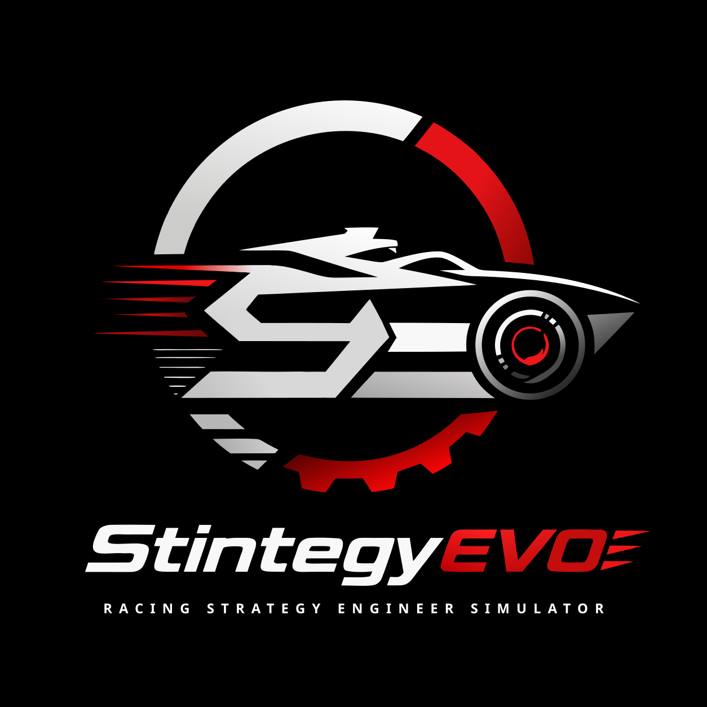

<p align="center">
  
</p>

# StintegyEVO – Racing Strategy Engineer Simulator

[中文正式版](README_zh.md)

_The maintainer will make every reasonable effort to keep the English and Chinese versions consistent. If a difference cannot be resolved, the Chinese version prevails._

**StintegyEVO** is a **physics-based racing strategy simulation game**. You play not as a driver, but as a **race engineer**. Your job is to command AI drivers to execute your tactics during races, qualifying sessions, and endurance races by making real-time adjustments to strategies such as **torque distribution, energy recovery, and tire thermal management**, and to verify the consequences of these decisions in a highly realistic physical environment.

> **Note: You do not need a controller or steering wheel.** All driving operations are performed by AI drivers; you only need to issue strategic commands.

---

## 🤝 Focused Collaboration Welcome

StintegyEVO is still an early engineering project, not yet a playable game. The core vehicle physics is implemented; the current blocker is foundational AI driving: making an AI-controlled car complete laps reliably under the existing nonlinear tire model, load transfer, and dynamically generated paths.

The repository is public and open to focused collaboration, but the project is still maintainer-led and exploratory. Gameplay scope, physics fidelity, AI architecture, and roadmap priorities may change while the first stable prototype is being found.

Collaboration is especially useful around:

* **Vehicle control and AI**: MPPI, MPC, racing AI, dynamic path planning, and alternative control approaches.
* **Vehicle dynamics**: Tire modelling, simulation validation, Formula Student, and motorsport engineering.
* **Godot 4 / C# engineering**: Simulation architecture, profiling, testing, telemetry, and debugging tools.
* **Art and interface design**: Low-poly vehicles, race-engineer UI, telemetry visualization, and technical presentation.

You do not need to solve the entire system. Design reviews, reproducible experiments, benchmarks, partial implementations, and unsuccessful approaches with useful conclusions are all meaningful contributions.

[Current AI task](https://github.com/MoYuSOwO/stintegy-evo/issues/9) · [Discussions](https://github.com/MoYuSOwO/stintegy-evo/discussions) · [Contributing guide](CONTRIBUTING.md)

---

## 🚀 Core Features

### 1. Modern Electric Racing Physics Engine
Not a simple acceleration/deceleration model, but a **complete four-motor independent drive physics system**:

* **Four-Wheel Independent Torque Vectoring**: Front/rear axle power distribution and independent torque control for inner/outer wheels during cornering, allowing real-time adjustment of vehicle steering characteristics.
* **Pacejka Magic Formula Tire Model**: Both lateral and longitudinal forces are generated by classic Pacejka curves, including friction circle joint limits.
* **Dual-Layer Tire Thermodynamics**: Surface temperature (friction-generated heat), core temperature (rolling-generated heat), dynamic tire pressure changes, and wear calculated based on slip power.
* **Composite Braking System**: Kinetic energy recovery and mechanical brake backup are unified under a "one-pedal" logic, featuring battery SOC protection and full-charge decoupling.
* **Load Transfer and Suspension**: Dynamic four-wheel independent loads based on longitudinal/lateral acceleration, including downforce distribution.

### 2. AI Strategy Execution (Planned)
Your AI driver will:
* **Speed Management**: Automatically control acceleration and deceleration based on track speed limits and preview distance.
* **Traction Control**: Monitor tire slip ratio in real-time and actively adjust power output to avoid excessive slipping.
* **Offensive and Defensive Awareness**: Overtaking, defending, and DRS/Attack Mode management.
* **Stylization**: Generate drivers with different driving styles through perception noise and decisiveness parameters.

### 3. Strategic Depth
You can make real-time adjustments during the race to:
* Front and rear axle drive power distribution
* Torque vectoring strength (cornering agility vs. tire wear)
* Kinetic energy recovery strength (power saving vs. corner entry stability)
* Motor target temperature / power limits
* Slipstream and dirty air meta (downforce loss)

### 4. Open Source & Extensible
* Fully self-developed physics engine, with no third-party physics middleware.
* Track data is defined based on curves, making it easy for the community to create new tracks.
* The Community Edition is open source under **AGPL-3.0**. Contributors keep ownership of their work, and accepted contributions remain open.

---

## 🧠 Design Philosophy

Racing games usually make you the driver. But in real racing, victory or defeat is often decided on the Pit Wall. StintegyEVO wants you to experience being **the person holding the tactical board**. You don't need zero-second reaction times, but you do need to understand the interplay of tires, motors, battery power, and aerodynamics.

### 🆚 Differences from Other Racing Games

| Dimension | Motorsport Manager | F1 Manager 2024 | iRacing | **StintegyEVO** |
|:---|:---|:---|:---|:---|
| **Positioning** | Racing Manager/Business Sim | Official F1 Team Management | Hardcore Driving Sim | **Racing Strategy Engineer Simulator** |
| **Physics Engine** | Simplified Numerical Model | Game-Level Physics | Industrial-Level Physics (NTMv7) | **Self-Developed EV Physics Engine** |
| **Powertrain** | Traditional ICE | F1 Hybrid (Abstracted) | ICE / Hybrid | **Modern Electric Racing Car** |
| **Driving Method** | AI Auto | AI Auto | Player Driven | **AI Executed, Player Issues Strategic Commands** |
| **Strategic Depth** | Pit Stops / Tires / Engine Modes | Pit Stops / Tires / ERS | On-Track Racing | **Torque Distribution, Energy Recovery, Motor Temp Management, Tire Thermodynamics, Slipstream & Dirty Air Meta, etc.** |
| **Tire Model** | Simplified Wear | Game-Level | Industrial-Level (NTMv7) | **Pacejka Magic Formula + Dual-Layer Temp + Dynamic Pressure** |
| **Extensibility** | Mod Support | Limited | Closed Ecosystem | **Open Source (AGPLv3)** |

### Why Can't Existing Games Do What StintegyEVO Does?

- **Traditional driving simulators (iRacing/ACC/Forza) make you the driver.** StintegyEVO makes you the race engineer.
- **Racing management games (MM/F1M) have strategy management, but their physics are numerical approximations.** You can't adjust torque vectoring or see dual-layer tire temperatures—because they lack a true physics engine underneath.
- **StintegyEVO is the intersection of both:** A strategy management simulation built on an industrial-level physics engine. The tactical depth of *Motorsport Manager* × the physical hardcore nature of EV engineering. This is the only racing strategy game on the market that drives all strategic decisions with a self-developed physics engine.

---

## 🛠️ Tech Stack

* **Engine**: [Godot Engine 4.x] (.NET Version)
* **Language**: C#
* **Physics**: Self-developed 2.5D vehicle dynamics (2D logic layer, 3D Low Poly rendering layer)
* **AI**: Controller based on preview distance + speed planning + slip ratio perception

---

## 🗺️ Roadmap

StintegyEVO is an independent solo-developed project. Currently, **core physics are complete, and AI foundational driving is the primary focus.**

### Versioning Philosophy

Each completed module receives a version number, marking its transition from "unavailable" to "functional." Pending goals use logical numbering to indicate **suggested priority and dependencies**; they do not strictly lock the release order. The roadmap is a working map for exploration, not a promise of stable API, feature scope, or release order.

If you are interested in any of these goals, focused experiments, small implementations, benchmarks, and design reviews are welcome. Contributors keep ownership of their work, and accepted contributions remain available to the community under **AGPL-3.0**.

### ✅ v0.1 Core Physics (Completed)

* **Tire Physics Model**
    * Pacejka lateral and longitudinal force curves.
    * Friction ellipse joint limits; natural competition between longitudinal and lateral grip.
    * Dual-layer thermodynamics (surface and core temperatures) and dynamic tire pressure.
    * Wear calculation based on slip work, supporting independent longitudinal/lateral wear coefficients.
    * Implementation of Ackermann geometry (independent steering angles for inner/outer wheels).
* **EV Powertrain & Energy Management**
    * Four-motor independent drive architecture with Torque Vectoring (front/rear and inner/outer distribution).
    * One-pedal logic: Seamless fusion of drive, kinetic energy recovery, and mechanical brake backup.
    * Battery SOC tracking; automatic recovery cutoff at full charge to prevent overcharging.
    * Independently adjustable regenerative braking intensity.
* **Chassis & Aerodynamics**
    * Dynamic load transfer (longitudinal/lateral acceleration) with four-wheel independent load calculation.
    * Front/rear downforce distribution and "Dirty Air" factor (downforce loss in wake).
    * Suspension damping smoothing to prevent numerical oscillation from sudden load spikes.

### 🚧 Pending Implementation (Ordered by suggested priority)

#### 1. AI Foundational Driving (Current Focus)
*Dependency: v0.1*

**The Goal**: Enable the AI driver to consistently complete laps with reasonable pace without hitting walls.

* **Inputs**: Dynamic track path, real-time vehicle state (speed, slip ratio, load, etc., accessible via `StintegyEVO.Core.Car.Controllers.CarSensor`).
* **Outputs**: Throttle/Brake pedal values, steering ratio (-1 to 1).
* **Known Challenges**: 
  * Paths are generated dynamically; speed planning cannot rely on offline baking.
  * Due to the non-linear coupling of Pacejka tires and load transfer, traditional "Look-ahead + PID" methods resulted in severe speed estimation errors in previous attempts.
* **Open Solutions**: No specific technical route is mandated. Whether it's End-to-End control, MPPI, MPC, Reinforcement Learning, State Machines, or your own hybrid method—if it stabilizes the car, it’s welcome.
* **Performance Requirement**: Must support 20+ AI cars competing simultaneously on a standard processor (2018 or newer).

**Why is this the top priority?** Every subsequent feature (racecraft, styling, energy strategy) is built on the premise that the AI can actually drive. Without this, everything else is a "castle in the sky."

#### 2. Motor Thermal Management
*Dependency: v0.1*

* Introduce a motor temperature model: heat generation via power output vs. air-cooled dissipation based on vehicle speed.
* Automatic power derating during overheating to prevent "infinite pushing."
* Provide "Target Motor Temperature" and "Power Ceiling" tuning for the strategy layer.

#### 3. Track Gradient & Camber
*Dependency: v0.1*

* Expand track data structures to support slopes (affecting longitudinal acceleration) and banking (affecting cornering centripetal force).
* Physics layer support: AI should adapt to new physical constraints automatically without needing explicit perception.
* Prepare for future real-world track imports.

#### 4. Driver Style System
*Dependency: Goal 1*

* **Perception Noise**: Biases in perceiving grip, speed, and distance to simulate human imprecision.
* **Decisiveness Slider**: Influences braking points, affecting both lap time and stability.
* Paves the way for differentiated competition between AI drivers.

#### 5. AI Racecraft (Offense & Defense)
*Dependency: Goals 1 & 4*

* **Overtaking**: Identifying the car ahead, dynamic path offsetting, and choosing the right moment to "pop out."
* **Defending**: Inside/outside line selection; adjusting aggressiveness based on remaining tire life and battery.
* Attack Mode / DRS simulation.

#### 6. Full Strategy Console
*Dependency: Goals 1-5*

* A slider-based interface to adjust torque distribution, recovery strength, motor temperature targets, and wing angles in real-time.
* The final form of the "Engineer Simulator": every strategic decision carries physical consequences.

#### 7. Race Weekend Framework
*Dependency: Goal 6*

* Complete flow for Practice, Qualifying, and Race sessions.
* Simple tire selection and setup presets.
* Moving from "lapping" to "racing."

#### 8. Low Poly 3D Visuals
*Dependency: None (Pure presentation layer)*

* Godot-based 3D rendering layer paired with 2D physics to create an *Art of Rally*-style aesthetic.
* Basic UI and Telemetry: Real-time display of tire temps, motor status, SOC, and lap time deltas.

#### 9. Track Editor Prototype
*Dependency: Goal 3*

* Allow players to create custom tracks that the AI can adapt to without offline baking.
* Infrastructure for a community-driven content ecosystem.

### 🌟 Long-Term Outlook

* **Multiplayer**: Multiple players commanding their respective teams in real-time online competition.
* **Advanced Simulation**: Safety Cars (SC/VSC), dynamic weather, track surface temperature, and standing water.
* **Career Mode**: Full team management, R&D trees, and a driver market.
* **Hardware-in-the-Loop**: Interfaces for real vehicle data acquisition or exporting the engine output to professional simulation software.

> **This roadmap describes goals, but implementation remains entirely open. Alternative proposals—even those that overhaul existing plans—are welcome.**

---

## 🏁 Quick Start

You can participate via the following methods:

```bash
git clone https://github.com/MoYuSOwO/stintegy-evo.git
```

Please open the project in the Godot 4.x .NET version. Ensure that .NET SDK 8.0+ is installed.

---

## 🤝 Contributing

StintegyEVO welcomes focused contributions. You don’t need to be a physics engine expert or a C# maestro, but contributions are most useful when they are tied to a concrete problem, experiment, or small implementation:

* **AI Development**: Tackle AI-related goals from the roadmap.
* **Physics Tuning**: Optimize tire parameters and motor characteristic curves.
* **Track & Vehicle Data**: Create new tracks or design vehicle configurations.
* **Art & UI**: Low Poly models, UI interfaces, and particle effects.
* **Documentation & Outreach**: Improve the README, write tutorials, or record demo videos.

### How to Get Involved

> **Before you begin, please read the [English](CONTRIBUTING.md) or [Chinese](CONTRIBUTING_zh.md) contributing guide for development setup, coding conventions, the CLA, and other details.**

1.  **Pick a Goal or Focused Problem**: Use the [Roadmap](#-roadmap) as context. Each entry lists dependencies and expected inputs/outputs, but the list is not meant to freeze the project direction.

2.  **Communicate First, Code Later**:
    * If your **idea is already formed** (e.g., "I'm going to implement basic AI driving using MPPI"), head over to [Issues](https://github.com/MoYuSOwO/stintegy-evo/issues) to create a task post. Outline your proposed solution and technical approach, and be sure to attach the relevant Issue Label.
    * If your **idea is still evolving** (e.g., "I want to work on AI but I'm not sure which method to use"), start a thread in [Discussions](https://github.com/MoYuSOwO/stintegy-evo/discussions) to get feedback from the community and maintainers.

    **Why communicate first?** The main challenge of this project isn't "writing the code," but rather "navigating the uncertainty of the approach." Communicating beforehand prevents you from spending weeks on a solution that might conflict with someone else's work or be incompatible with the existing architecture. Broad feature requests or large rewrites may be deferred until the core driving and product loop are clearer.

3.  **Start Contributing**: Communication is for coordination, not an approval gate. Once the scope is clear—or immediately for a small, self-contained improvement—you can begin. Please read the [English CLA](CLA.md) and the [governing Chinese CLA](CLA_zh.md) before submitting a contribution.

We look forward to advancing this project together while fully respecting the copyright and intellectual property of every contributor.

---

## 📜 License

This project is open-sourced under the **GNU Affero General Public License v3.0 (AGPL-3.0)**.  

The standalone Community Edition will remain open source. The [CLA](CLA.md) gives the maintainer a limited additional license for a possible future official online version, so shared systems such as physics, AI, and UI would not need to be rewritten. It does not permit converting the standalone Community Edition into a proprietary product or selling individual contributions separately. The maintainer will make every reasonable effort to keep the [English](CLA.md) and [Chinese](CLA_zh.md) texts consistent; if a difference cannot be resolved, the Chinese text prevails.

---

## 💬 Contact

* Maintainer: MoYuSOwO
* Email: stintegy-evo@proton.me
* Discussions: [GitHub Discussions](https://github.com/MoYuSOwO/stintegy-evo/discussions)

---

> **"We don't compete on who drives faster. We compete on who calculates better."**
